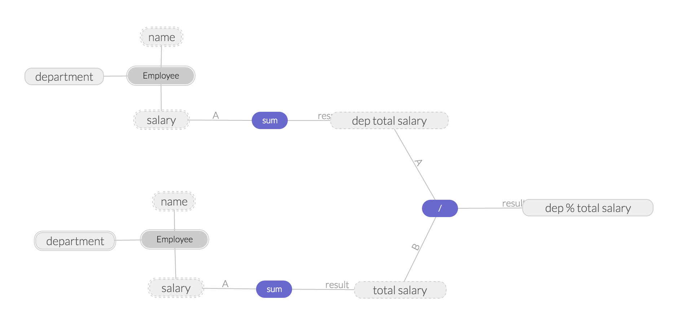
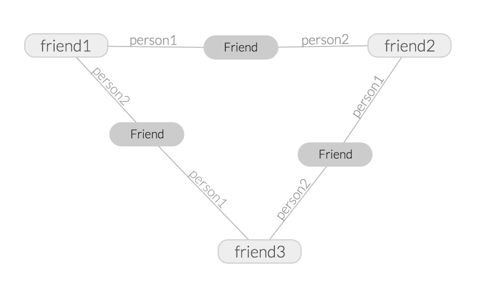
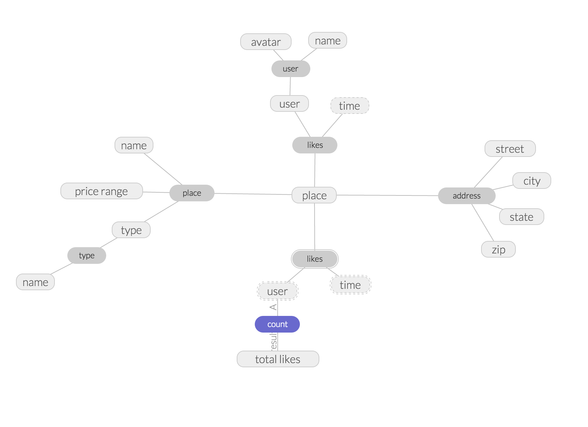

### A note on visual programming.

We know that the tendency will be for people to dismiss Eve as just another boxes and arrows attempt at visual programming. Visual programming carries a lot of historical baggage with it and for the most part, it's only found success in a few niches despite having been touted as a sort of silver bullet for the accessibility of programming. It's gotten a bad rap from overpromising and underdelivering. Part of that is that there are a set of fundamental problems in the space that people tend to ignore, the other part is that most visual languages try to take the same programming model and just turn it into pictures. With Eve we approached the editor very carefully, deliberately trying to ensure we didn't fall into the same traps.

We've had numerous strategies for the UI so far, everything from a plain textual interface, to a pure spreadsheet-like interface, to mathematica-like notebooks and everthing in between. In each, we learned more and more about the essential nature of writing "programs" in the language that Eve presents. As an example, one of the more interesting editors we had presented code to you as when/do blocks with madlibs:


Most of these attempts, while interesting seemed to simply push complexity around. The last one we built before we moved to the graph-based editor tried to merge the idea of tables and code together:


It was with this one that we really came to understand what we were missing in all of these; queries are fundamentally graph structured. The structure of the joins between relations is crucial to understanding what the query does and all of these UIs forced you to recreate that structure in your head. If you're just looking at a list of equalities, how do you see at a glance that you're dealing with a star query? Or that you're looking for a triangle of friends? At its most basic, what you're specifying in a query is a shape of data that you want found within the system. By specifying a query in text or 2d grids, we're obscuring the essence of what we're asking for: a shape.

The most natural way to communicate a small to medium size graph is to draw it. When trying to show queries to eachother in the office we actually drew them as diagrams, but it took us a while to make the leap that writing them that way would work. Part of that is the inherent leariness we had of visual programming. Some of the early prototypes of Eve were visual dataflow languages and we found that they quickly ended up a mess, but queries are different - they don't express a sequence or a set of actions, merely a structure. It's been really interesting to see how much better people have been able to approach seeing and manipulating that structure directly as opposed to specifying it in text. Here are a few simple examples showing a SQL query and then what that looks like in Eve:

**Get the total salary of all employees then find out what percentage each department represents of that.**

```
SELECT
    employee.department,
    (sum(employee.salary) / total.totalSalary) as '% total salary'
FROM
    employee,
    (SELECT sum(employee.salary) as 'totalSalary' FROM employee) as total
GROUP BY
    employee.department
 ```



**Find all the triangles of friends, i.e. a group of three friends where A is friends with B, B is friends with C, and C is friends with A.**

 ```
 SELECT
    friendA.person1 as friend1,
    friendB.person1 as friend2,
    friendC.person1 as friend3
 FROM
    friend as friendA,
    friend as friendB,
    friend as friendC
 WHERE
    friendA.person2 = friendB.person1,
    friendB.person2 = friendC.person1,
    friendC.person2 = friendA.person1
 ```

 

**In building a foursquare clone, get all the users that have liked a place, the total number of likes, plus address, place type, and standard place information.**

 ```
 SELECT DISTINCT
    place.name, place.priceRange,
    address.street, address.city, address.state, address.zip,
    type.name,
    likeCounts.count as totalLikes,
    user.name, user.avatar
FROM
    place,
    address,
    likes,
    user,
    type,
    (SELECT likes.place, count(*) as count FROM likes GROUP BY likes.place) as likeCounts
WHERE
    place.place = address.place,
    place.place = likes.place,
    place.place = likeCounts.place,
    place.type = type.type,
    likes.user = user.user
 ```
 

While someone may not know what all the symbols mean, most people are able to guess roughly what is going on in all of those graphs given a couple minute explanation of querying, whereas most shut down on the first SQL query. This is not to say that to someone who knows SQL Eve's graphs are immediately more intuitive or easier to read (for some they are, for others they may not be), but they're at least no worse than the equivalent SQL and they impart information that you otherwise have to try to extract and rebuild from the text. There's lots to improve here and it may turn out we find something else, but so far this has been much more pleasant to work with than our previous incarnations. And while we think that visual graphs are a [natural mapping](https://en.wikipedia.org/wiki/Natural_mapping_(interface_design)) for queries, that doesn't magically absolve us from the issues visual languages have traditionally faced.

One of the seminal papers on the problems with visual programming languages (VPLs) is [Scaling Up Visual Programming Languages](http://web.engr.oregonstate.edu/~burnett/Scaling/ScalingUp.html) by Burnett et al. In it, Dr. Burnett breaks the issues with VPLs down into two main categories, representation issues and programming language issues. Let's go through them for Eve:

####Representation issues

**Static representation**

Some languages (e.g. programming by example languages) don't have a natural static representation, which can make dissemination difficult. Our query graphs are static, though we can make use of dynamism in lots of interesting ways, so this isn't an issue for us. The internet also made this less of an issue overall - we're not passing programs around in magazines much anymore.

**Screen real estate**

Queries are fairly finite in size. They do not scale with the overall complexity of what you're trying to make. Instead, they are only as complicated and large as what you're asking for. A big point in our favor is that as a declarative language our programs are also much smaller. The madlib-based IDE I showed early was bootstrapped and written in just 600 lines of Eve. Beyond that though, there's lots of opportunity for progressive disclosure to help retain screen space, for example the 'peek' results you get when selecting a source in a query or the ability to dive in and out of nodes.

Another somewhat more complex point is that because queries only rely on the existence of data which you can always peek at, you don't need to be able to see as many 'bits of code' as you normally do. When writing in traditional languages you often have to look at other functions to know what you're going to get if you use them or what the state of something might look like at any given time. Even with a powerful type system, you're only being given a glimpse into the contract of a function and often need to look at the implementation to get a sense of what you'll really end up with. For example types don't give you information about the distribution of the values you're working with. When writing queries in Eve, those answer are a peek away and because of its declarative nature, you don't need to see the "how" nearly as much.

**Documentation**

A number of VPLs suffer from having virtually no documentation facilities or workflows that don't encourage their use. The emphasis on a canvas-like workspace opens up the opportunity for drawings and other visual "comments" in Eve. On top of that, our plans for version control make every action in the system replayable, so you can send a change to someone and they can watch it happen. We capture as much context as possible and Eve is entirely live, so we gain many of the properties she talks about in this section for free.

#### Programming language issues

**Procedural abstraction**

Queries are our primary unit of abstraction. You can use queries inside of other queries and unions allow you to merge multiple queries together into an open unit. E.g. I might define a top performers union and then have various departments provide their own queries to determine who their top performers are. So far this has been sufficient for us to build numerous examples, including a clone of Foursquare. One thing that is definitely still an open question for us though, is exactly what form code reuse will take. There's a lot more work to be done there.

**Interactive visual data abstraction**

We lean on the relational model to handle our data abstraction needs, which means we don't really have any traditional concerns here. We don't have data-structures. We do think we'll eventually want custom scalar types though, and potentially custom relation implementations (e.g. efficiently representing a matrix as something other than a b-tree backed table).

**Type checking**

This is definitely a big open area for us. We will have a type system, but it's not yet clear exactly what form it will take. That being said, we have a very powerful mechanism for ensuring correctness at our disposal: integrity constraints. While not in version 0, we previously implemented integrity constraints simply as queries, which means you can make arbitrarily complex constraints to ensure your data is valid.

**Persistence**

We're a database!

**Efficiency**

Version 0 is fairly dumb and doesn't try to be incremental, but we've had versions that were and we intend to be entirely incremental once the runtime matures. With that and the magic of whole program query optimization, we should be able to produce something that is at least as fast as your favorite scripting language. Having such a small language also makes it much easier for us to optimize.

Another aspect of efficiency she didn't mention is how difficult it is to read and write the given representation. There's still a lot we can do to improve in both regards, but in most cases you can create a query as fast as you can type it and it doesn't take long for the graphs to become natural to read. One thing we definitely want to do here is replace our individual functions nodes with a formula node. This will help cut down on the size of the graph as well as make it more efficient to do more complex math/processing.

#### Beyond coding

Dr. Burnett also has a single paragraph for aspects outside of coding itself, which I think she downplays a bit too much as one of the biggest problems with visual programming languages is how you deal with debugging them as the system grows. Queries provide us a nice small unit of "work" to deal with, but when queries start relying on other queries, we start to need ways to understand how all the pieces fit together. This is a place where Eve can really shine. Given that everything in the system is a view, we have complete provenance information. In other words, we know where every piece of data comes from and how it comes to be what it is later on. This enables us to do "why? debugging," where you could click on a value and ask "why is this what it is." We can then show you the values that went into producing whatever you selected and the exact path they took through all the queries to get there. You can even then start to ask questions about that path, e.g. when did this value get greater than 10? With the ability to ask that kind of question, debugging goes from being a hunting and pecking excercise full of printlns to a couple of clicks.

#### Scaling Eve up

We will certainly have a lot of work to do to overcome some of the growing pains I imagine we'll have as we scale Eve programs to larger project and ever larger numbers of people working in the same place, but at the very least we are aware of the potential problems we'll face. We manage to sidestep a lot of the problems because we're not representing imperative instructions as blocks or whole programs as circuits, but instead providing a visual representation of query structure, which has a [long history](https://en.wikipedia.org/wiki/Entity%E2%80%93relationship_model). We ended up with this approach because this is what we were doing despite the other representations we had and we're excited to see how we can push on the edges of what's possible given a visual language. Fortunately, however, our code is just more data inside the system and that leaves us open to having any number of representations, whether they be textual, graphical, or any combination thereof. In no way are we claiming there's going to be one "right" way to work with Eve and we're ensuring that we leave ourselves the freedom to use the right tool for the job.